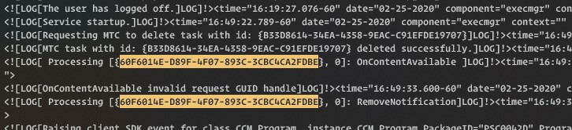

# :closed_lock_with_key: JM.AdminTools

Some PowerShell helpers for SysAdmin daily tasks

## Installation

You can get the current release from this repository or install this from the PowerShell Gallery:

```powershell
iex ((New-Object System.Net.WebClient).DownloadString('https://raw.githubusercontent.com/Reyozam/JM.AdminTools/master/InstallModule.ps1'))

Import-Module JM.AdminTools
```

## Functions

#### Windows OS
___
### Watch-Service

Watch a service and restart it if it stops
```powershell
PS C:\>Watch-Service -ServiceName wuaserv

VERBOSE: [12:29:33] Watching service wuauserv...
VERBOSE: [12:29:38] Service wuauserv is running...
VERBOSE: [12:29:43] Service wuauserv is running...
WARNING: [12:29:48] Service wuauserv has stopped !
VERBOSE: [12:29:48] Restarting service wuauserv...
VERBOSE: [12:29:54] Service wuauserv is running...
```

### Get-ComputerUptime

Get computer uptime
```powershell
PS C:\>Get-ComputerUptime -computername Server01

LastReboot          TimeSpan
----------          --------
27/02/2020 20:43:26 6.18:02:01.4243612
```
### Get-InstalledSoftware

Get installed software
```powershell
PS C:\>Get-InstalledSoftware -computername Server01

DisplayName                                                        Publisher                     UninstallString
-----------                                                        ---------                     ---------------

Git version 2.22.0.windows.1                                       The Git Development Community "C:\Program Files\Git\unins000.exe"
Microsoft Visual Studio 2010 Tools for Office Runtime (x64)        Microsoft Corporation         c:\Program Files\Common Files\Microsoft Shared\VSTO\10.0\Microsoft Visual Studio 2010 Tools for Office Runtime (x64)\install.exe Mozilla Firefox 70.0.1 (x64 fr)                                    Mozilla                       "C:\Program Files (x86)\Mozilla Firefox\uninstall\helper.exe"
```
### Get-OpenFile

Get open file on a computer
```powershell
PS C:\>Get-OpenFile -computername Computer01
PS C:\>Get-OpenFile -computername Computer01 -filename doc01.docx
```

### Get-RegistryKeyProperties

Get registry key values
```powershell
PS C:\>Get-RegistryKeyProperties -Path HKCU:\Environment

Path              Property                 Value
----              --------                 -----
HKCU:\Environment TEMP                     C:\Users\KM5078\AppData\Local\Temp
HKCU:\Environment TMP                      C:\Users\KM5078\AppData\Local\Temp

...
```
### Export-FirewallRules

Export Firewall Rules from criteria
```powershell
PS C:\>Export-FirewallRules -Direction Both -State Enabled -Action Allow -ExportFile C:\BackupFirewall.json
```

### Import-FirewallRules

Import Firewall Rules from criteria
```powershell
PS C:\>Export-FirewallRules -ExportFile C:\BackupFirewall.json
```

### Get-RemoteLocalGroup

Get member of a local group on remote computer
```powershell
PS C:\>Get-RemoteLocalGroup -Computername server01 -Credential $Credentials

ComputerName 	UserName
------------ 	--------
server01 		Administrator
server01 		Contoso\Domain Admins
server01 		Contoso\GRP-HELPDESK
server01 		Contoso\GRP-APP-ADMINS
```

### Invoke-RunAs

Start a process as différent user
```powershell
PS C:\>$Credential = Get-Credential

Invoke-RunAs -command cmd.exe -credential $Credential
```

### Set-EnvironmentVariable

Set Environment Variable in machine or user context
```powershell
PS C:\>Set-environmentvariable -Name "Test" -value "TestValue" -target Machine
```
### Start-ProcessQuiet

Start a process in background and return output
```powershell
PS C:\>Start-ProcessQuiet -Filepath "cmd" -argument "/c dcdiag"
```


#### Network
___
### Get-IPv4Subnet

Calculate Subnet information from an IP and a Mask/CIDR
```powershell
PS C:\> Get-IPv4Subnet 10.20.100.6 -CIDR 24

NetworkID : 10.20.100.0
FirstIP   : 10.20.100.1
LastIP    : 10.20.100.254
Broadcast : 10.20.100.255
IPs       : 256
Hosts     : 254
Mask      : 255.255.255.0
24        : 24

PS C:\> Get-IPv4Subnet 10.20.100.6 -Mask 255.255.0.0 

NetworkID : 10.20.0.0
FirstIP   : 10.20.0.1
LastIP    : 10.20.255.254
Broadcast : 10.20.255.255
IPs       : 65536
Hosts     : 65534
Mask      : 255.255.0.0
16        : 16
```

### Get-ARPCache

Powershell equivalent of **arp -a**
```powershell
PS C:\>Get-ARPCache

Interface     IPv4Address     MACAddress        Type
---------     -----------     ----------        ----
10.22.235.252 10.22.235.1     00-25-B4-D8-CD-80 dynamique
10.22.235.252 10.22.235.167   6C-0B-84-42-DC-A3 dynamique
10.22.235.252 10.22.235.255   FF-FF-FF-FF-FF-FF statique
10.22.235.252 224.0.0.2       01-00-5E-00-00-02 statique
10.22.235.252 224.0.0.22      01-00-5E-00-00-16 statique

```

### Start-PortScan

Start a port scan on the selected computer on common TCP Ports
```powershell
PS C:\>Start-PortScan

Service : FTP Data
Port    : 20
Status  : Closed

Service : FTP Command
Port    : 21
Status  : Closed

Service : SSH
Port    : 22
Status  : Closed

Service : TelNet
Port    : 23
Status  : Closed

...
```

### Start-Supervision

Monitoring ping on multiple target
```powershell
PS C:\>Start-Supervision  -hosts server01,server02,server03,server04

 _____________________________________________________
| HOST     | STATUS | SUCCESS  | FAILURE  | ATTEMPTS  |
| server01 | UP     | 100,00%  | 0,00%    | 5         |
| server02 | UP     | 100,00%  | 0,00%    | 5         |
| server03 | UP     | 100,00%  | 0,00%    | 5         |
| server04 | DOWN   | 0,00%    | 100,00%  | 5         |

```

### Test-Port

Test port status on remote computer
```powershell
PS C:\>Test-Port -computername Server01,Server02 -Port 3389,445,22

Computername Port Protocol Result
------------ ---- -------- ------
SERVER01     3389 TCP        True
SERVER01     445  TCP        True
SERVER01     22   TCP       False
SERVER02     3389 TCP        True
SERVER02     445  TCP        True
SERVER02     22   TCP       False

```
### Test-RemoteManagement

Test remote management capabilities of a target computer
```powershell
PS C:\>Test-RemoteManagement -computername Server01,Server02 -Protocol WMI,WinRM

Comuter    Ping    WMI     WinRM
-------    ----    ----    ------
Server01   True    True    True
Server02   True    True    False
```


#### Files
___

### Find-StringInFile

Search for a string in all files present in a path
```powershell
PS C:\>Find-StringInFile -search "string" -path C:\users\

Filename Path                                        LineNumber Matches
-------- ----                                        ---------- -------
test.txt C:\Users\user\OneDrive\test.txt             1 {9}
```

### Update-StringInFile

Replace a string in one or multiple files.

Binary files (*.zip, *.exe, etc.) are not touched by this script.
```powershell
PS C:\>Update-StringInFile -Path E:\Temp\Files\ -Find "Test1" -Replace "Test2" -Verbose

VERBOSE: Total files with string to replace found: 3
VERBOSE: Current file: E:\Temp\Files\File_01.txt
VERBOSE: Number of strings to replace in current file: 1
VERBOSE: Current file: E:\Temp\Files\File_02.txt
VERBOSE: Number of strings to replace in current file: 1
VERBOSE: Current file: E:\Temp\Files\File_03.txt
VERBOSE: Number of strings to replace in current file: 2
```
### Trace-Log

Read log and highlight Success/Warning/Error. -Wait allow to wait for new Log Entries.
```powershell
PS C:\>Trace-Log -LogPath C:\temp\log.log -Wait
```


### Trace-Word

Look and highligh from words in a file content
```powershell
PS C:\>Trace-Word -Content (Get-content "C:\Windows\CCM\Logs\execmgr.log") -words "60F6014E-D89F-4F07-893C-3CBC4CA2FDBE"
```


### Sync-Folder

Sync two folder via Robocopy
```powershell
PS C:\>Sync-Folder -source C:\Folder01 -destination C:\Folder02
```


#### Other
___
### Get-WebFile

DownloadFile from a URL
```powershell
PS C:\>Get-WebFile https:\\donwload.fr\file.zip
```

### New-Password

Generate Password
```powershell
PS C:\>New-Password -length 20 -include UpperCase,LowerCase, Numbers

cjlGF6D983TatznN2YkJ
```

### Test-Credential

Test local or AD credential on remote computer
```powershell
PS C:\>$Credential = Get-Credential
Test-credential -credential $Credential -domain contoso.com
Test-Credential -credential $Credential -computername server01
```

### ConvertFrom-Error

Return Error information in a object
```powershell
PS C:\>ConvertFrom-Error $error[0]

Exception : Tentative de division par zéro.

Reason    : RuntimeException
Target    : 
Script    : Test-Error
Line      : 1
Column    : 1
```

